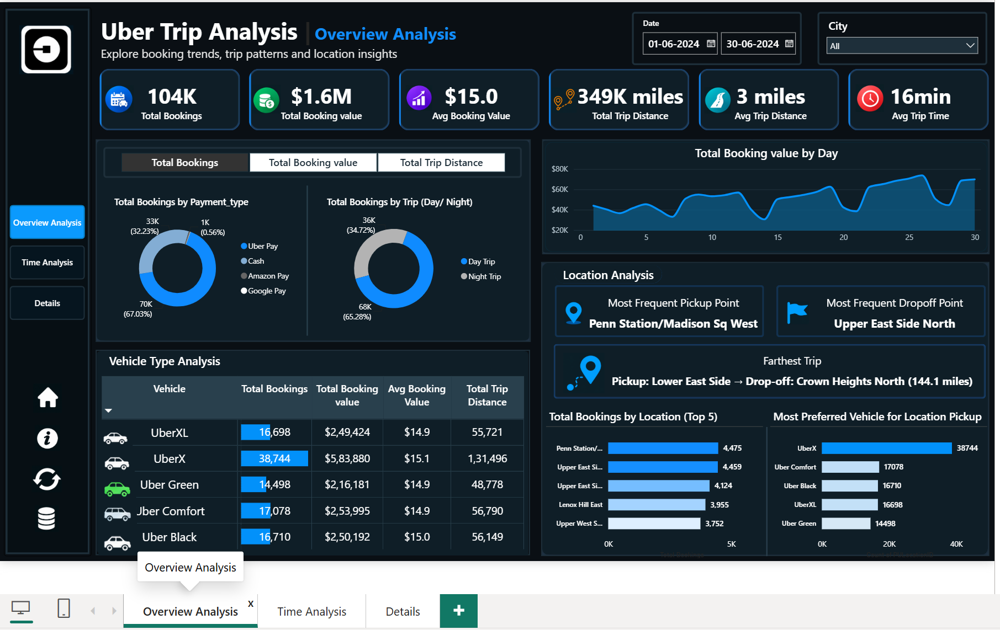
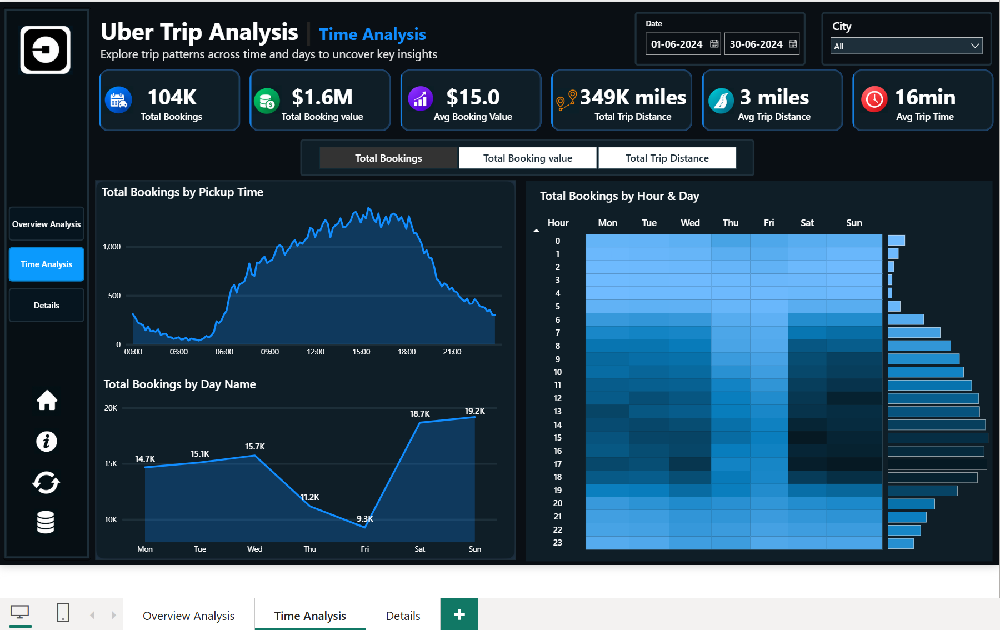
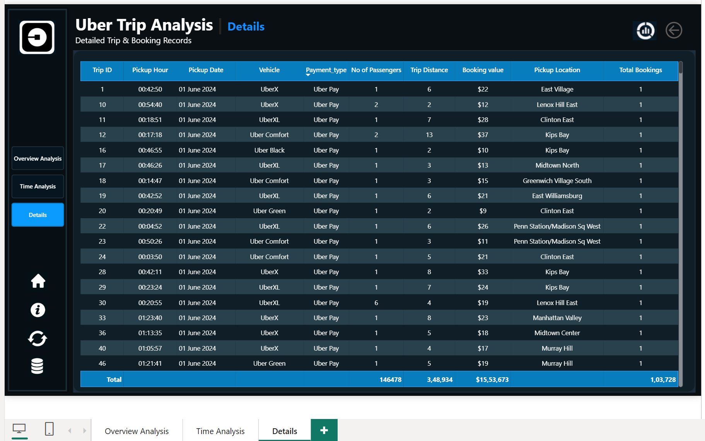

# 🚖 Uber Trip Analysis — Power BI Dashboard

An end-to-end Power BI project that transforms raw Uber trip-level data into an interactive, three-page analytical dashboard — built to support data-driven decisions around demand planning, pricing, driver allocation, and operational efficiency.


---

## 📌 Table of Contents

- [Overview](#-overview)
- [Dashboards](#-dashboards)
- [Key Features](#-key-features)
- [Screenshots](#-screenshots)
- [Tools & Technologies](#-tools--technologies)
- [Repository Structure](#-repository-structure)
- [Key Insights](#-key-insights)
- [Business Requirement → Implementation](#-business-requirement--implementation)
- [How to Use](#-how-to-use)
- [Author](#-author)

---

## 📖 Overview

This project analyzes **100K+ Uber trip records** to uncover patterns in booking volume, revenue, trip efficiency, payment behavior, vehicle performance, and location/time-based demand. It was built using **Power BI**, with data modeling, DAX measures, Field Parameters, drill-through, and bookmarks to create a fully interactive, app-like reporting experience.

**Key business questions answered:**
- How many trips were booked, and what revenue did they generate?
- Which payment methods, vehicle types, and locations perform best?
- How does demand vary by hour, day, and day/night split?
- Which pickup/drop-off points and trips stand out?

---

## 📊 Dashboards

| Dashboard | Purpose |
|---|---|
| **1. Overview Analysis** | Executive-level KPIs, payment type, day/night split, vehicle performance, and location analysis |
| **2. Time Analysis** | Pickup-time trends, day-of-week demand, and an Hour × Day heatmap |
| **3. Details** | Full trip-level grid with drill-through and a "view full data" bookmark |

---

## ✨ Key Features

- ✅ Dynamic Measure Selector (Field Parameters) — switch between Total Bookings, Total Booking Value, and Total Trip Distance across visuals
- ✅ Dynamic chart titles that update based on the selected measure
- ✅ Custom DAX for location analysis (Most Frequent Pickup/Drop-off Point, Farthest Trip) using `USERELATIONSHIP()`
- ✅ Dedicated Calendar table with active/inactive relationship management
- ✅ Drill-through from summary visuals to a detailed trip grid
- ✅ Bookmarks for full-data reset and info panels
- ✅ Custom navigation (Home, Info, Clear Filters, GitHub link icons)
- ✅ Date and City slicers with tooltips for deeper context

---

## 🖼 Screenshots

### Overview Analysis


### Time Analysis


### Details


> 📁 Screenshot files are stored in [`03_Dashboard/`](./03_Dashboard). Update the paths above if your filenames differ.

---

## 🛠 Tools & Technologies

- **Microsoft Excel** — source data
- **Power BI Desktop** — dashboard development
- **Power Query** — data preparation and transformation
- **DAX** — measures and calculated columns
- **Power BI Data Model** — relationships and star-schema style modeling
- **Field Parameters** — dynamic measure selection
- **Bookmarks & Drill-through** — interactivity

---

## 📁 Repository Structure

```
├── 01_Dataset/          # Source Excel files (Trip Details, Location Table)
├── 02_PowerBI/          # .pbix Power BI project file
├── 03_Dashboard/        # Dashboard screenshots
└── 04_Documentation/    # Business requirements & full project documentation
```

---

## 💡 Key Insights

- **Sunday and Saturday** drive the highest booking volume, booking value, and trip distance — weekend demand consistently outpaces weekdays.
- Demand builds steadily from **6:00 AM**, peaks in the afternoon, and tapers off through the evening.
- **UberX** is the leading vehicle category across bookings, revenue, and distance.
- **Uber Pay** is the dominant payment method, accounting for ~67% of bookings and ~71% of booking value.
- **Day trips** account for ~65% of bookings, value, and distance versus night trips.
- The farthest recorded trip ran **144.1 miles** (Lower East Side → Crown Heights North) — a notable outlier against the ~3-mile average.

---

## ✅ Business Requirement → Implementation

| Business Requirement | Implementation | Status |
|---|---|---|
| KPI Analysis | KPI Cards | ✅ Completed |
| Dynamic Measure | Field Parameter | ✅ Completed |
| Time Analysis | Area Charts + Heatmap | ✅ Completed |
| Location Analysis | DAX Measures + Charts | ✅ Completed |
| Details Grid | Table Visual | ✅ Completed |
| Drill-through | Details Page | ✅ Completed |
| Bookmarks | Full Data / Info Views | ✅ Completed |
| Navigation | Page & Icon Navigation | ✅ Completed |

---

## 🚀 How to Use

1. Clone or download this repository.
2. Open the `.pbix` file in [`02_PowerBI/`](./02_PowerBI) using **Power BI Desktop**.
3. Explore the three report pages: **Overview Analysis**, **Time Analysis**, and **Details**.
4. Use the Date/City slicers and the Dynamic Measure selector to interact with the visuals.
5. Full write-up and DAX reference are available in [`04_Documentation/`](./04_Documentation).

---

# 👨‍💻 Author

**Nikhil Ramagiri**

Aspiring Data Analyst | SQL | Power BI | Excel | Python

📧 Email:ramagirin45@gmail.com

🔗 LinkedIn: www.linkedin.com/in/nikhil-ramagiri-21b2a324a

🔗 GitHub: https://github.com/RamagiriNikhil

---

⭐ If you found this project useful, consider giving it a star!
